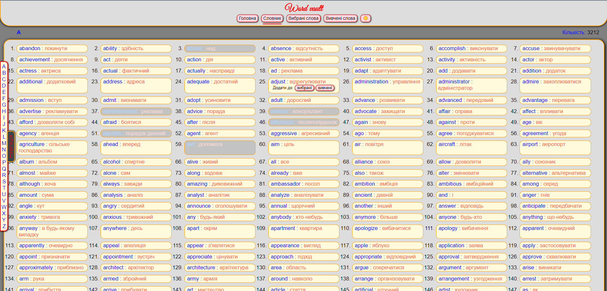
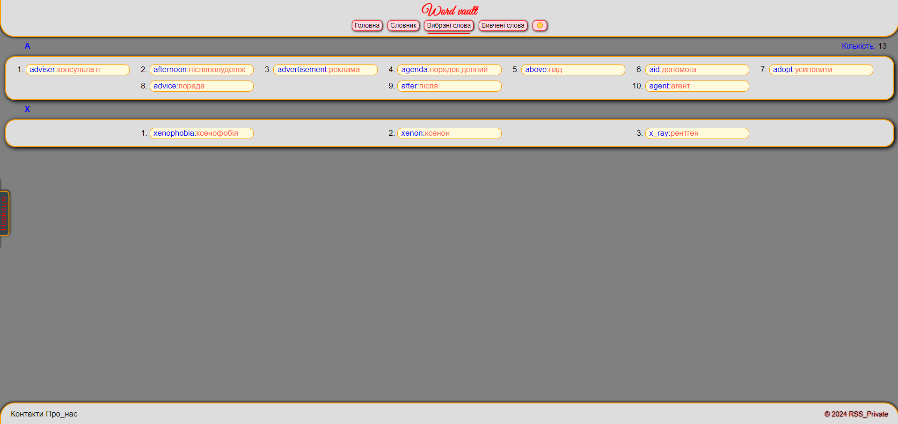
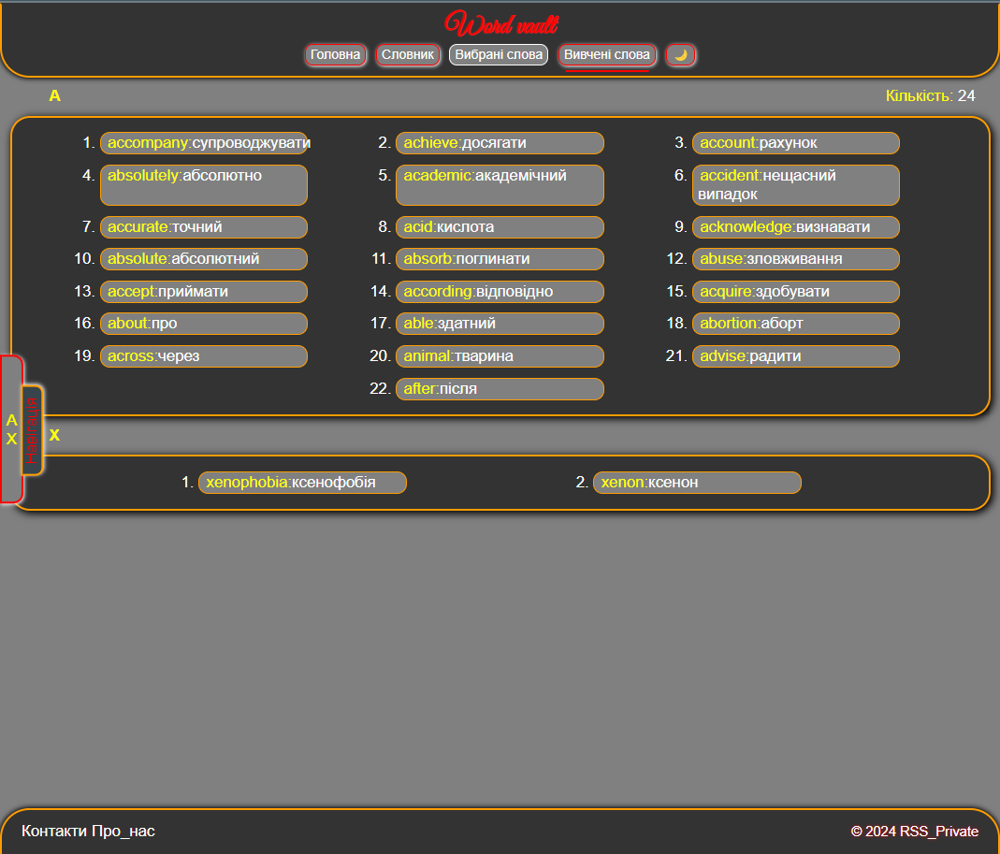
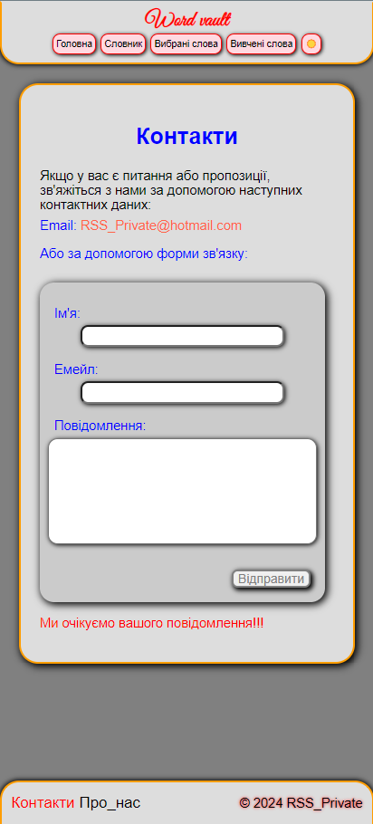

## "Learning English Language"
>The website page is designed for learning English words and has the following features:

### Basic functions
* **Dictionary:** The page contains a dictionary that includes 3234 words with their translations.
* **Adding to Favorites:** Users can add words from the dictionary to the "Favorites" section. Words added to favorites are marked as inactive in the dictionary and displayed in a different color so that users can quickly distinguish them from other words. 
* **Adding to Learned:** Users can add words from the dictionary to the "Learned" section if they already know them. After adding a word to learned, it is automatically removed from the dictionary. 
* **Further Work with Words:** Users can work with words they have added to favorites or learned on separate panels. For example, they can study words from the "Favorites" section, then move them to the "Learned" section after studying. In the "Learned" section, they can review learned words or return them to the dictionary.
* **Saving:** All user progress is saved until their account is deleted.    
This functionality allows users to effectively organize the process of learning English words, providing convenient tools for tracking their progress and working with words. This project is still in development, but it can already be used!

### Tech stack
* [X] **React**: *JavaScript-library* for building user interfaces.
* [X] **Vite**: Fast and advanced web application development tool.
* [X] **React Router**: Library for navigating and managing pages in *React* applications.
* [X] **Yup**: This is a JavaScript library for validating data in forms. It provides a simple and convenient way to define validation rules for different data types such as strings, numbers, dates, etc.
* [X] **EmailJS**: This is a service that allows you to send emails directly from the frontend of your web application, without having to set up your own mail server. It offers a simple API to send emails from anywhere in your client application.
* [X] **React Hook Form**:  Is a library for managing forms in React using hooks. It provides a simple and convenient way to create, validate and track the state of forms without using complex class components.
* [X] **Styled Components**:  Is a library for React and React Native that allows you to write CSS as JavaScript. It allows you to create reactive, mutable component styles that allow you to easily control the appearance of your application based on the state of the components.
___
[Link to the site with the *WordVault*](https://rss-777.github.io/WordVault/)

___
### Screenshot

    
     
    
    

